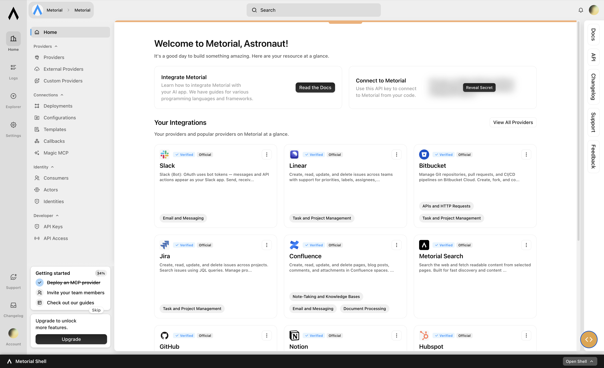
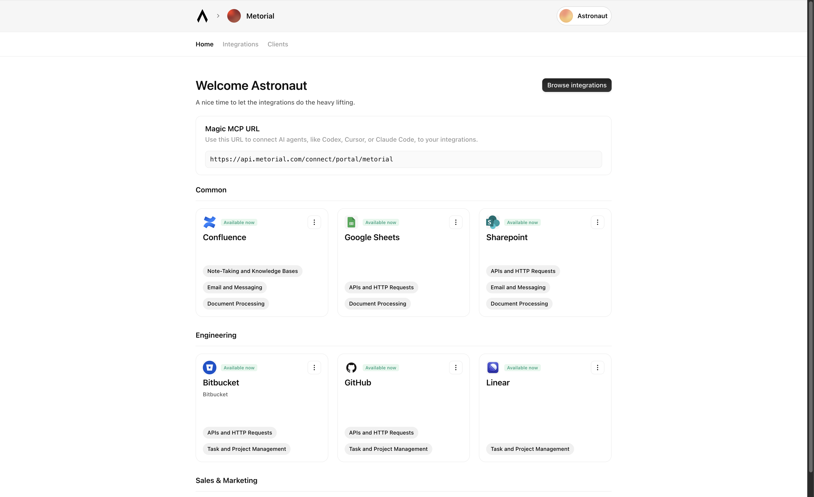

<p align="center">
  
</p>

<h1 align="center">Metorial</h1>

<p align="center">
The open-source identity and access layer for AI agents.
</p>

## Why Metorial?

Enterprises have spent years building identity and access layers for humans. Agents are now being connected to the same systems without an equivalent agent identity layer around them.

That creates familiar problems in a new form: credential sprawl, integration silos, unclear permissions, and weak auditability. Teams need to be able to answer simple questions clearly:

- What can this agent do?
- Who does it act for?
- How are its actions audited?

Metorial is the layer built around those questions.

It gives teams one place to use managed integrations from a catalog, proxy remote MCP servers, or host custom servers — then share them across teams and projects with permissions, access control, and auditability around them.

In practice, Metorial gives teams access to thousands of integrations and handles auth, access control, and logs across them.

## Product surfaces

Metorial has two main surfaces:

### Metorial Platform



Metorial Platform is the developer surface.

It lets teams use managed integrations, proxy remote MCP servers, or host custom servers, with the identity, access control, and auditability layer around them.

This is the core platform for building and deploying agent integrations in production.

### Metorial Portals



Metorial Portals is the employee-facing surface.

It gives employees a marketplace of integrations they can connect to, with access provisioned through SSO and SAML group-based delegation.

This gives internal AI rollouts a cleaner distribution and access model across teams, without turning access management into a manual IT workflow.

## What Metorial handles

Metorial is built for teams that need to answer the operational questions around connected agents in a repeatable way:

- managed access to thousands of integrations
- AI-native access control
- RBAC, SAML SSO, and IAM
- auth and token handling across integrations
- logs and auditability around agent actions
- shared access patterns across teams and projects
- managed catalog, remote MCP proxying, or custom-hosted servers

## Ecosystem

* [Metorial](https://github.com/metorial/metorial): 1000+ high-quality integrations covering major SaaS tools and enterprise systems
* [Metorial Platform](https://github.com/metorial/metorial-platform): The core engine behind Metorial, fully open source and self-hostable
* [Metorial Platform](https://github.com/metorial/cli): An agent-first CLI to interact with Metorial resources and integrations
* [Lowerdeck](https://github.com/metorial/lowerdeck): Shared libraries used across the stack and available for standalone use
* [Starbase](https://github.com/metorial/starbase): MCP debugging and testing utility

## SDKs

Our SDKs expose the Metorial API and let teams connect agents to real systems with auth, access control, and auditability handled through the same layer.

They also include adapters for popular AI frameworks such as Vercel AI SDK and LangChain.

*  [**JavaScript / TypeScript**](https://github.com/metorial/metorial-node)
*  [**Python**](https://github.com/metorial/metorial-python)

Here is an example of creating an OAuth flow for a Slack integration after setting up the Client ID + Secret, and then providing the tools for that authenticated connection to an agent framework of your choice, here Vercel AI SDK.

### JavaScript / TypeScript

```ts
let setupSession = await metorial.providerDeployments.setupSessions.create({
  providerId: "slack",
  providerAuthMethodId: "oauth",
});

console.log(setupSession.url);

let session = await metorial.connect({
  adapter: metorialAiSdk(),
  providers: [
    {
      providerDeploymentId: "slack-deployment-id",
      providerAuthConfigId: "auth-config-id",
    },
  ],
});

console.log(session.tools())
